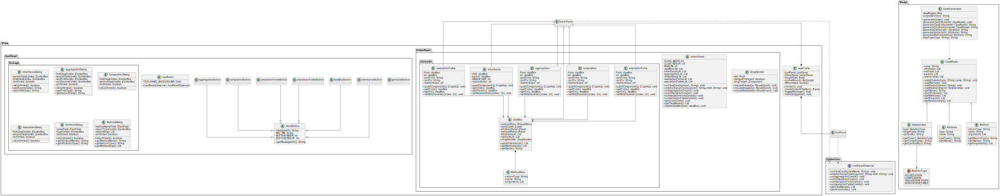

# Project Skeleton Generator

A Java Swing desktop application for creating UML class diagrams and generating Java code from them.

## Screenshots

### Main Interface

*The main application window with the tool panel on the left and the diagram canvas on the right.*

### Creating Classes

*Adding a new class to the diagram with attributes and methods.*

### Adding Relationships

*Different relationship types between classes: inheritance, aggregation, composition, and associations.*

### Context Menu

*Right-click context menu for adding attributes, methods, or deleting a class.*

### Generated Code

*Example of Java code generated from the diagram.*

## Class Diagram



## Architecture

The application follows an MVC-like pattern:

- **Model**: Contains data structures (ClassModel, Relationship) and business logic (CodeGenerator)
- **View**: Swing components for the user interface (appFrame, tinkerPanel, toolPanel)
- **Controllers**: The toolPanelObserver interface mediates between View and Model

The tinkerPanel implements toolPanelObserver, receiving notifications from tool buttons and managing the diagram state.

## Usage

1. Run the application via Main.java
2. Click the class button to create a new class
3. Right-click on a class to add attributes or methods, or to delete it
4. Use the relationship buttons to connect classes
5. Click "Generate Code" to export Java files to a selected directory

## Relationship Types

| Type | Visual | Code Output |
|------|--------|-------------|
| Inheritance | Triangle arrow | `extends` keyword |
| Aggregation | Hollow diamond | Field reference |
| Composition | Filled diamond | Field reference |
| Strong Association | Solid line, filled arrow | Field reference |
| Weak Association | Dashed line, open arrow | Field reference |

Cardinality affects the generated field type:
- Single (`0..1`, `1..1`): Direct type reference
- Multiple (`0..*`, `1..*`): `List<Type>`

## Requirements

- Java 24 or compatible JDK
- No external dependencies

## Building and Running

```bash
cd src
javac 
java Main
